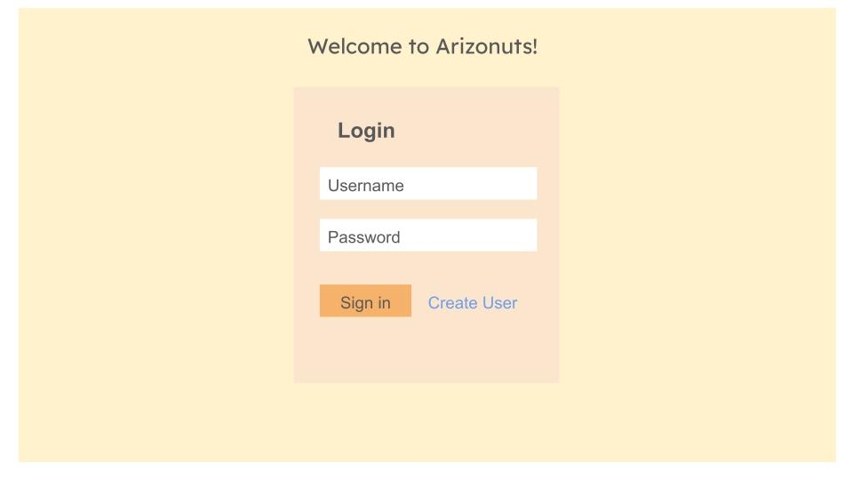
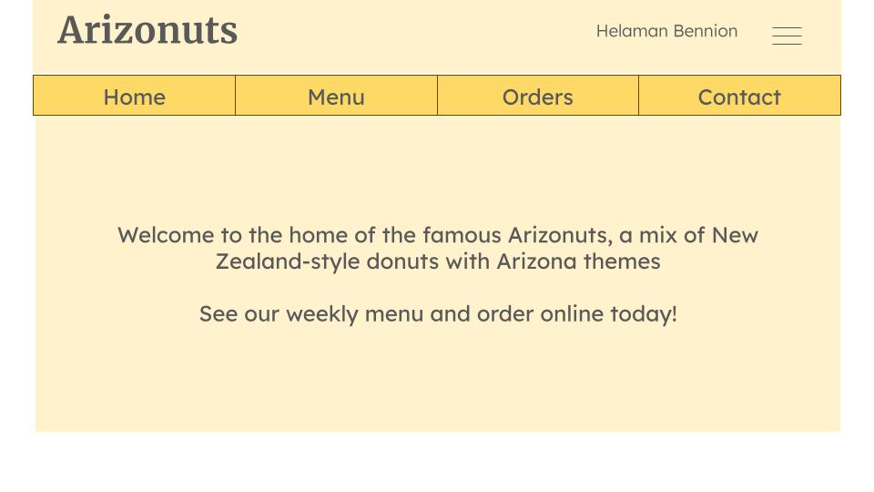
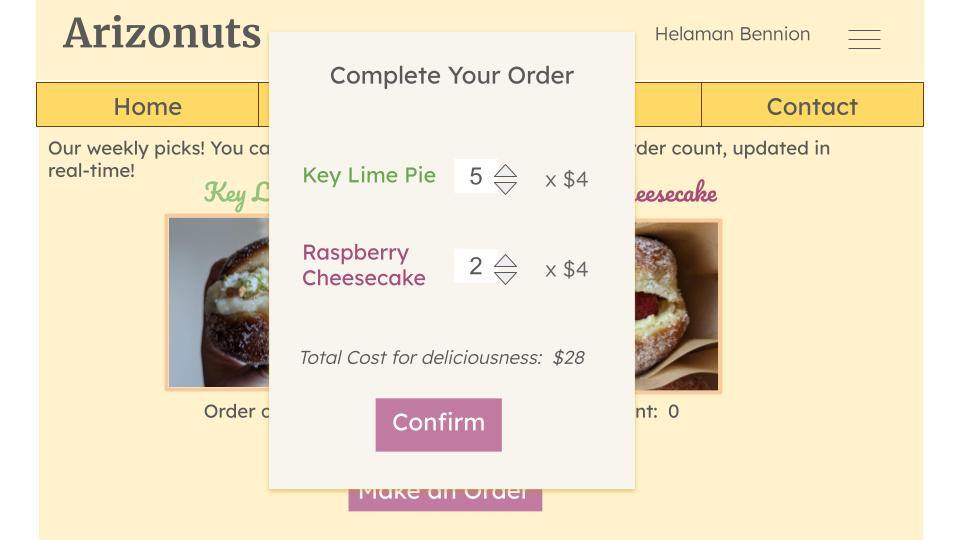
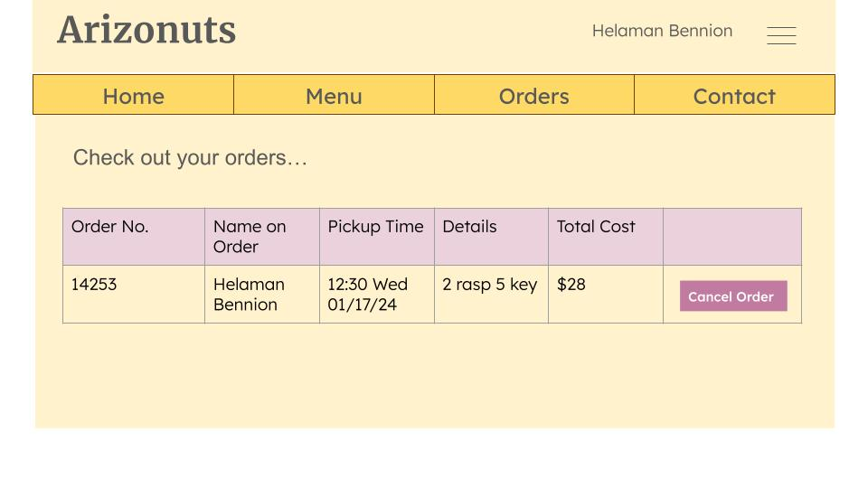
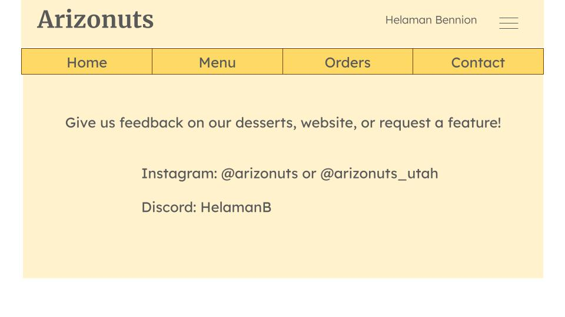

# Startup Project - Arizonuts
Looking for a tasty dessert? Perhaps a thoughtful gift for a friend? Welcome to **Arizonuts**, the latest and tastiest innovation in Provo! 
These fluffy filled pastries are made to order, not to sit and stale-ify on the counter. Through our online website, you can order one or several of these handcrafted delicacies and have it ready for pickup within minutes! 

Order a box of fresh Arizonuts today!

## Website Features

Our website includes the following features:
- State-of-the-art login service for a personalized experience and secure transactions
- A tasty display of the Arizonuts menu (updated weekly!)
- Ability to order Arizonuts from the weekly menu and be assigned a pickup time
- Transactional history of all orders with the option to cancel pending pickup orders
- Contact info of business owner for questions or feedback
- Appealing designs and colors, intuitive UI, and tasty donuts!

## Website Technologies

- **Authentication:** Each user must create a login and verify their identity before accessing data. Their name will be displayed after login
- **Database data:** Every order submitted will be stored in a MongoDB database. These orders can then be accessed and displayed for the user in the **Orders** tab
- **WebSocket data:** Every time a user orders a donut (or several) the order count for those donuts updates for every user in real-time, thus accurately showing the most popular donut choices each week

## Example Layout and Design

### Login

### Home

### Menu

### Order Confirmation Dialog

### Past Orders

### Contact Page

## Current Progress

### HTML

I recently added the following features to the page
- "Welcome" index page with **Login** placeholder and link to **GitHub repo**
- "Menu" page with images of donuts and placeholders for order counts (**WebSocket data**), button placeholder for ordering
- "Orders" page which displays a table as a **Database data placeholder**, showing pending and past orders
- "Contact" page with **third-party app data** placeholder (loads pictures of Arizona) and another link to GitHub repo
- Each page contains a **navigation bar** with links to each page, above which the website title and username are displayed

### CSS

I recently added the following stylistic features to the page
- All text in font Merriweather Sans (Except page title which is in Merriweather)
- Background and fonts colors
- Spacing in all areas
- button:hover animation
- Footers

