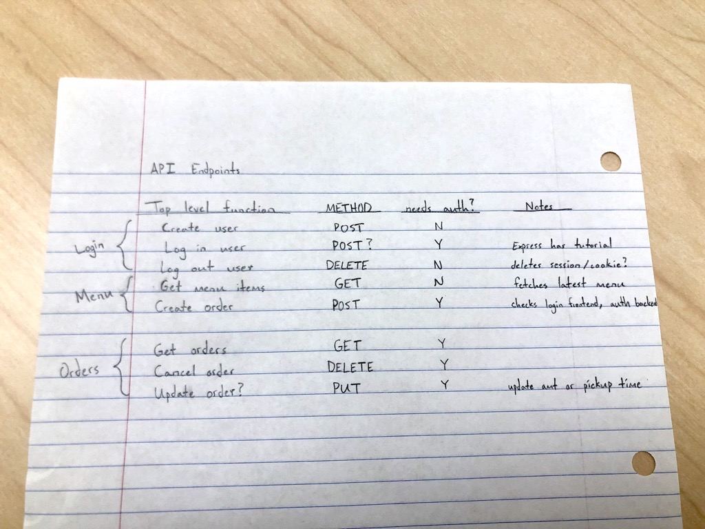
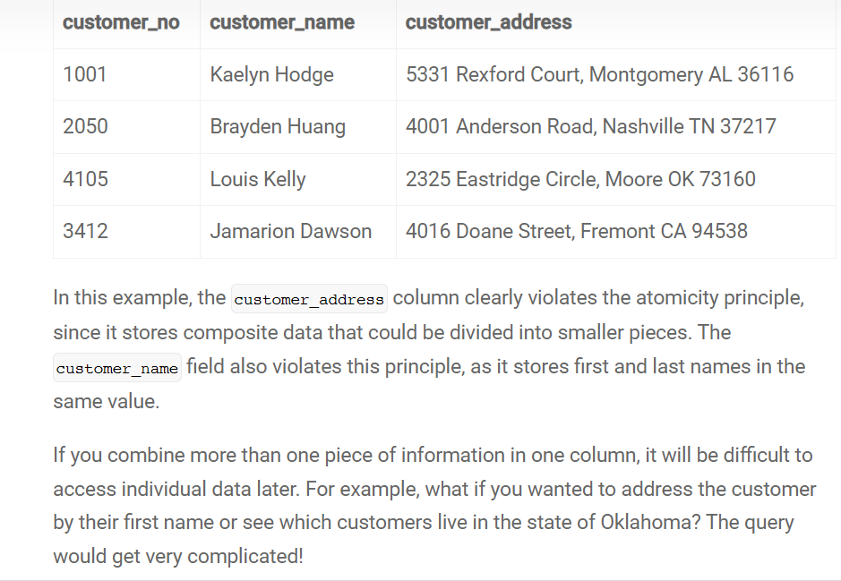

# CS 260 Notes

### Assignment 1 - Git and GitHub

I learned that merging conflicts is tricky business. I had to reset to an earlier commit because I messed things up too much. That is, however, the true beauty of Git. After doing so, I managed to merge my changes.
I learned a bit of markdown for this assignment. I plan to have good looking .md files, particularly for the README.

### Assignment 2 - Startup Specification

I used Google Slides to create a mock layout of my website and, contrary to my initial fears, it was relatively quick. I was able to come up with a basic layout with basic styling in an hour for 4 different tabs.
Also, I just learned in class that I need to call a third-party server/API.

I may want to add customized settings for the user, like emailing a copy of the order receipt or a ready-for-pickup notification.
Also, perhaps choosing pickup times (which would be challenging but impressive) and use WebSocket to update taken and available times.

For my API I will use **Pexels** and display a new image of Arizona everyday on the website.

### Assignment 3 - AWS Services

**Public IP address:** 54.144.126.138

**Website URL:** https://arizonuts.click

### HTML

I learned about how to use the `target` attribute in a link tag to specify how the link should open (i.e. in a new tab, in the current tab, etc.)

I learned that injecting different html into an html page (say like new content for each tab) is very difficult and requires a lot of JavaScript,
so we will just wait on that until React can make that easy for us.

I actually learned this from CS 235, but functions are called methods when they are members of a class

Web Service (API): Disify does email address validation which seems pretty useful. Might incorporate that.

### CSS

Within stylesheet, @tags can make it more dynamic. Use @font-face to bring in fonts to use, @import for external css (also used for fonts)

Animation example: 
p {
  animation: <name-of-animation> <duration #s>;
}

@keyframes <name-of-animation> {
  from {  // start
    font-size: 0vh;
  }
  95% {
    font-size: 20vh;
  }
  to {  // end
    font-size: 10vh;
  }
}

### HTML deliverable

Note: I have no idea what to use the footer for. The instructions say to use it, but I don't have any uses for it yet.

### CSS deliverable

Boostrapping looks very handy. Remember to download their stylesheets in case their servers ever go down.
I think on the `contact` page I want to add a carousel with 5 or more pictures pulled in

### Javascript deliverable

You can console.log() with CSS applied as well. Never knew that. Also not sure where that would be handy.
Ternary operator ? <true result : <false result>
Optional chain: object.function?.() Evaluates is function is nullish, if so stops operation
Combine optional chain with fallback method: object.function?.() || fallback()
Destructuring arrays: [x] = a == x = a[0] || [x, y] = a == x, y = a[0], a[1]
[x, y, z = 100] where if no a[2] z defaults to 100
[x, , y, ...z] where we skip a[1] and then z = remainder or a[3:]

Apply the 'use strict' header to the js file and it will require you to fix common mistakes (like unstrict comparison ==)
DOM methods with .innerHTML is nice but frowned upon because people can inject code into it and it will run
Instead use .createElement then .textElement = text <= this won't be run

Apply the 'use strict' header to the js file and it will require you to fix common mistakes (like unstrict comparison ==

DOM methods with .innerHTML is nice but frowned upon because people can inject code into it and it will run
Instead use .createElement then .textElement = text <= this won't be run
localStorage (use until we have database) it is a small space on the browser
localStorage.setItem & localStorage.getItem

### Revisions

After brainstorming with Lexy I came up with a number of things I want to add/change...

- A separate Login page with a login button in the top right corner
- Home page that describes our business a bit more
- Links to instagram account
- Logo at the top
- More sectional pages (like Waffle love)
- A carousel of pictures
- Make login card bigger
- Make footer responsive

### Midterm Review

- 'A' record is an address record: Connects hostname to ip address
- 'CNAME' is essentially an alias: You tell it to reroute a hostname to another hostname  (not redirect, just alias)
- Study Regex syntax
- Web API and promises? Is it multithreading to call a promise (wtih timeout) without awaiting it?
- Promises and async await (same thing, different syntax): Promise.then() <- only that which is in the .then() waits for the promise to resolve
- Await is the same, it just takes all the code after it and sticks it in a .then() block

## Design

What am I expecting my user to actually accomplish with my program?
What is the application actually doing?

- Sequence diagram (sequencediagram.org)

### Endpoints

- Login
- Logout
- Submit Order
- Get Orders
- Cancel Orders

Authentication is handled with cookies (after auth included in header with every request)\

### Endpoint Design

Grammatical - Noun/resource based (it is an object)
Readable - /store/provo/order/28502
Simple - Single responsibility principle (each endpoint does one thing)
Documented - Open API (quasi-standard)

Remote procedure call (RPC)
Ex. POST /updateOrder
{"id": 12345, "date": "today"}

This is more functional instead of resource based - Prof. Jensen doesn't like it

REST (http)
PUT /order/2147
verb noun

Functional vs. OOP - RPC vs. REST

GraphQL
query {
  getOrder(id: "2197") {
    orders(filter: {date: {allofterms: "2134567"} }) {
      store
      description
      orderedBy 
    }
  } 
}

CORS Policy - cross site request forgery
fetch request - JS await fetch

### Web Service Deliverable

order JSON format
{
string: id
string: name_on_order
string: time
string total_cost
object items: {
  string: id
  float: price
  int: amount
  }
}

## Deployment and Production Systems
* Rolling drain and replace

Most services have multiple servers with a load balancer. 
When updating system, do one at a time. Load balancer routes requests to other servers while you work on one, get it back online, then repeat with the next server.

* Canary

Put the canary down the hole to see if it dies quickly or not (if it's safe)
Put out update on one server, route like 10% of traffic there and monitor logs, make sure it is working right, then slowly push the updates to the rest of the servers

* Blue/Green

Green is the new cluster, blue is old. Transfer slowly, if issue then immediately reroute back to blue.

* A/B (marketing)

Test out a new feature on a specific location, demographic, whatnot. Track status and see if better or not. Kind of like canary.

^^^ This is good to keep in mind. For a transactional website, a single point of failure (particularly if updates are made) is an issue.
Servers should be stateless - you should be able to kill, delete, remove, put up servers willy nilly
Don't store database (or any state, files, etc.) on server

At some point, I should mark all the points of failure for the website so debugging will be easier in the future

## Database

MySQL is jack-of-all-trades, other DBs are specialized
Databases can be turned on and off, data is persisted

### Coding guidelines (for myself)

***Try-Catch Statement***
- Don't put them in every function - only where there is chance of failure (error)
- UPDATE: For now, only put try-catch in index.js in request handlers

***Comments***
- Put before every function (clarify parameter and return types, basic outline of function)
- If doing something hacky, put comment to explain

Wireshark is a program that grabs all packets transferred across the network, unencrypted traffic not safe

Cookies store session information (authentication, language preference, browsing history, length of stay, etc.)

## UI/Backend Testing

Better processes for testing pages. Programs like Jest, Playwright, Storybook are really efficient
Playwright for frontend, Jest for backend. Need to figure out how it works.

TODO: 
- Need to cleanup unused functions in index.js
- Need to optimize code in index.js and db layer transactions

## Performance

- If you have things cached on your machine, things will load faster. You need to clear the cache and see what it looks like the first time it loads
- Optimize - there are slides for this, checkout Google Lighthouse, pingdom.com, dotcom-tools.com

## UX

- "Don't make me think" ~Steve Krug (UX Guru)
- Lycos vs. Google
- You know instantly what you are supposed to do - no effort on your brain
- Design as a story (it's about the journey as much as the destination)
- Consistency
- Look at slides for holy grail of website layout
- Sitemap - draw out nav model from page to page, consider what the user will want to do from each page
- Move "Orders" into profile dropdown
- paletton.com, color.adobe.com - really good for finding a color palette
- Primary, Secondary, Focus colors
- Documentary about a font "Helvetica"
- The less fonts is better
- Typically sans serif for headers and serif for content (because we're used to that in books and flowing content)
- Whitespace has power
- Images must add values
- Decision fatigue - The time necessary to make a decision increases logarithmically with the number of options
- Device responsiveness
- Accessibility
- Walls - do not introduce walls in your application if you can help it, is the user willing to work through that wall? (Like making an account)

## PWA

- Super awesome
- whatapwacando.com

